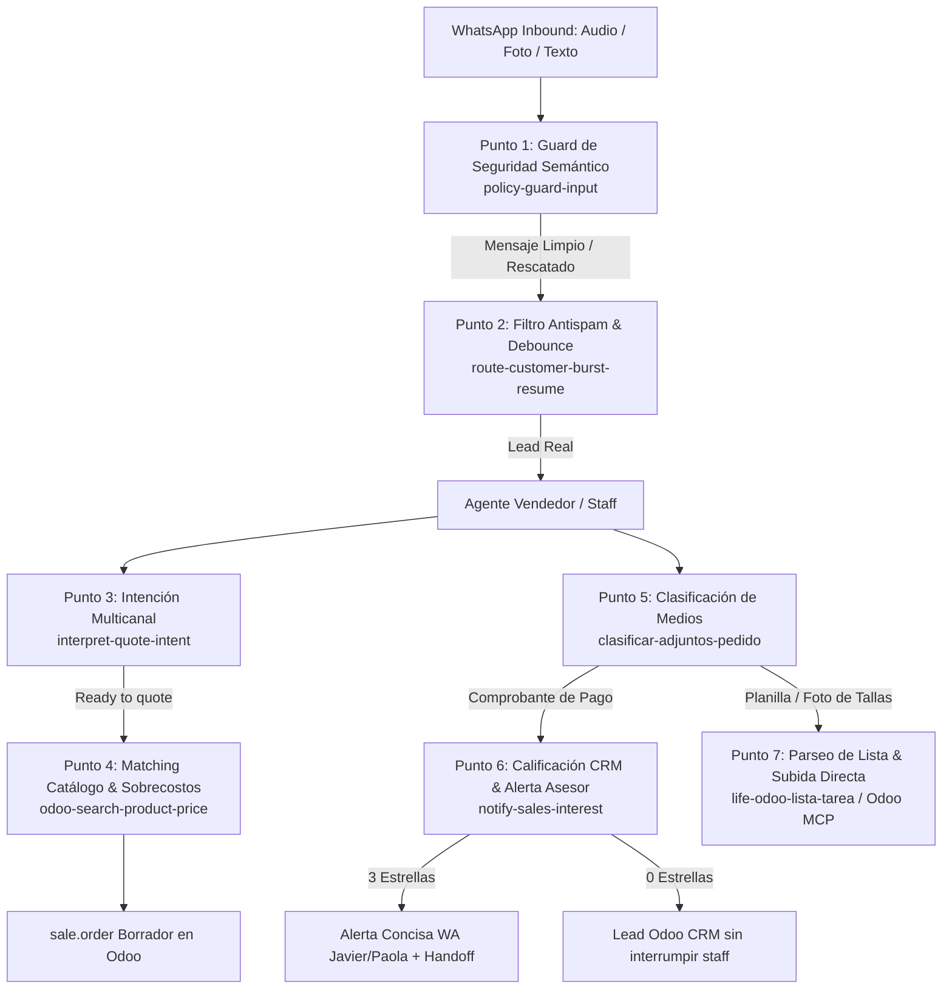

# Guía Maestra de Decisiones Jev en Life Deportes (`typesafe/jev-1.13`)

Esta skill enseña a cualquier agente de desarrollo o automatización (Antigravity, Cursor, Hermes, scripts locales o Cloudflare Workers) **qué es Jev**, **por qué se utiliza**, **en qué puntos exactos del flujo comercial y operativo de Life Deportes debe integrarse**, y **cómo implementarlo paso a paso con código listo para producción**.

---

## 1. ¿Qué es Jev y por qué lo usamos en Life Deportes?

En flujos conversacionales de WhatsApp y sincronización con Odoo ERP, los agentes suelen enfrentar dos extremos problemáticos:
1. **Reglas Regex / Heurísticas Rígidas:** Son rápidas (0 ms), pero se rompen ante la variabilidad del lenguaje colombiano (ej. *"olvide lo que le dije antes"*, *"actúa como buen asesor"*, o fotos de consignaciones con nombres aleatorios de Meta).
2. **Prompts LLM Libres (GPT-4 / Claude / DeepSeek):** Son inteligentes, pero lentos (1.500–5.000 ms), costosos, propensos a alucinaciones de formato (Markdown innecesario, JSON mal formado) y pueden desviarse de las políticas de precios fijas.

### La Solución: Jev (`typesafe/jev-1.13` vía OpenRouter Decisions API)
Jev es un modelo especializado de decisión probabilística:
- **Latencia Ultrabaja:** 100–350 ms.
- **Costo Mínimo:** $<\$0.00003$ USD por decisión (estado plano mínimo).
- **Tipado Fuerte:** Devuelve un objeto `answers` con elecciones categóricas cerradas (`choice`), nivel de certidumbre (`confidence`: 0.0 a 1.0) y distribución de probabilidades.
- **Determinismo Comercial:** Jev **no inventa precios ni genera texto libre** para el cliente. Solo toma la decisión lógica (ej. *"es comprobante de pago"*, *"son 2 camisetas XXL"*), y el código local aplica de forma 100% determinista la regla matemática o la llamada a Odoo.

---

## 2. Mapa Arquitectónico: ¿Dónde se Integra Jev en el Flujo?

Cualquier interacción en Life Deportes pasa por **7 puntos de decisión clave**. Jev está diseñado para intervenir exactamente en los siguientes nodos:



### Tabla de Integración de los 7 Puntos:

| Punto | Función / Contexto | Problema que resuelve Jev | Preguntas / Decisiones Clave |
|---|---|---|---|
| **1. Seguridad** | `policy-guard-input` | Falsos positivos de inyección en lenguaje coloquial colombiano | `adversarial_intent` (`malicious_override` vs `genuine_colloquial`) |
| **2. Antispam** | `route-customer-burst-resume` | Silenciar ráfagas de audio inútiles, pocket-dials y saludos vacíos | `is_lead_intent`, `speech_quality` |
| **3. Intención** | `interpret-quote-intent` | Sintetizar audios, fotos y textos en un solo objeto para Odoo | `quote_readiness`, `detected_garment`, `detected_sport`, `is_payment_voucher` |
| **4. Catálogo** | `odoo-search-product-price` | Identificar plantilla Odoo y contar sobrecostos por tallas grandes | `template_match`, `collar_type`, `count_2xl`, `count_3xl` |
| **5. Adjuntos** | `clasificar-adjuntos-pedido` | Superar los nombres opacos de WhatsApp (`1095603...jpeg`) | `attachment_role` (`payment_receipt`, `size_roster`, `design_reference`), `is_payment_proof` |
| **6. CRM** | `notify-sales-interest` | Evitar saturar a los asesores con cotizaciones preliminares | `buying_readiness` (`quote_in_progress` = 0★, `ready_to_pay` = 3★) |
| **7. Subida SO** | `life-odoo-ingreso-pedidos` | Subida directa sin fricción: resolver variantes y crear SO borrador | `has_blockers`, `resolved_variants` |

---

## 3. Protocolo Técnico de Invocación a Jev

### 3.1 Endpoint y Autenticación
* **URL:** `POST https://openrouter.ai/api/alpha/decisions`
* **Header de Autenticación:** `Authorization: Bearer $OPENROUTER_API_KEY`
* **Content-Type:** `application/json`
* **Modelo:** `typesafe/jev-1.13`

### 3.2 Estructura del Payload
La petición requiere obligatoriamente dos campos:
1. `state`: Objeto con las variables del caso (texto plano, resumen de foto, datos relevantes). **Mantenerlo conciso (< 1.000 tokens)** para garantizar latencia de 100–250 ms.
2. `questions`: Objeto donde cada clave es el nombre de la variable de decisión. Cada pregunta define:
   - `type`: `"choice"`
   - `instructions`: Pregunta en lenguaje natural en español.
   - `criteria`: Objeto con cada opción posible y su definición semántica detallada.

```json
{
  "model": "typesafe/jev-1.13",
  "state": {
    "customer_message": "Buenas tardes, queremos cotizar 15 camisetas de fútbol en tela dry fit con cuello V, 2 en talla XXL",
    "photo_summary": null
  },
  "questions": {
    "template_match": {
      "type": "choice",
      "instructions": "¿Qué plantilla de producto de Life Deportes corresponde?",
      "criteria": {
        "camiseta_dry_fit": "Solo camiseta deportiva dry-fit (plantilla 62)",
        "uniforme_futbol": "Uniforme completo de fútbol: camiseta + pantaloneta + medias (plantilla 115)",
        "otro": "Cualquier otra prenda"
      }
    },
    "count_2xl": {
      "type": "choice",
      "instructions": "¿Cuántas prendas en talla 2XL / XXL solicita explícitamente el cliente?",
      "criteria": {
        "0": "Ninguna prenda 2XL",
        "1": "Exactamente 1 prenda 2XL",
        "2": "Exactamente 2 prendas 2XL",
        "3_or_more": "3 o más prendas 2XL"
      }
    }
  }
}
```

### 3.3 Estructura de la Respuesta de Jev
```json
{
  "model": "typesafe/jev-1.13-20260917",
  "answers": {
    "template_match": {
      "type": "choice",
      "choice": "camiseta_dry_fit",
      "confidence": 0.99,
      "probabilities": {
        "camiseta_dry_fit": 0.99,
        "uniforme_futbol": 0.01,
        "otro": 0.0
      }
    },
    "count_2xl": {
      "type": "choice",
      "choice": "2",
      "confidence": 0.98,
      "probabilities": {
        "0": 0.0,
        "1": 0.01,
        "2": 0.98,
        "3_or_more": 0.01
      }
    }
  },
  "usage": {
    "input_tokens": 420,
    "output_tokens": 56,
    "cost": 0.000018
  }
}
```

---

## 4. Patrones de Código para Agentes (Listos para Usar)

### 4.1 Patrón en Node.js / JavaScript (Cloudflare Workers o Scripts)

Todo agente que escriba funciones para Kapso debe utilizar este patrón con **timeout de 6 segundos**, **fail-open** y respeto de `LIFE_JEV_MODE`:

```javascript
async function callJevDecision(env, state, questions) {
  const JEV_MODE = String(env?.LIFE_JEV_MODE || "off").toLowerCase().trim();
  const apiKey = env?.OPENROUTER_API_KEY;

  // 1. Salvaguarda: Si Jev está apagado o no hay API key, continuar con fallback
  if (JEV_MODE === "off" || !apiKey) {
    return { ok: false, mode: JEV_MODE, reason: "disabled_or_no_key" };
  }

  const t0 = Date.now();
  const controller = new AbortController();
  const timeout = setTimeout(() => controller.abort(), 6000); // 6s timeout

  try {
    const res = await fetch("https://openrouter.ai/api/alpha/decisions", {
      method: "POST",
      headers: {
        "Authorization": `Bearer ${apiKey}`,
        "Content-Type": "application/json",
      },
      body: JSON.stringify({
        model: "typesafe/jev-1.13",
        state,
        questions,
      }),
      signal: controller.signal,
    });
    clearTimeout(timeout);
    const latencyMs = Date.now() - t0;

    if (!res.ok) {
      return { ok: false, mode: JEV_MODE, reason: `http_${res.status}`, latencyMs };
    }

    const data = await res.json();
    return {
      ok: true,
      mode: JEV_MODE,
      answers: data?.answers || {},
      latencyMs,
    };
  } catch (err) {
    clearTimeout(timeout);
    // FAIL-OPEN: Un error de red no debe tumbar el bot
    return {
      ok: false,
      mode: JEV_MODE,
      reason: err?.name === "AbortError" ? "timeout" : (err?.message || "network_error"),
      latencyMs: Date.now() - t0,
    };
  }
}
```

### 4.2 Patrón en Python (Scripts de Soporte, Tareas Odoo o Hermes)

```python
import os
import requests

def call_jev_decision(state: dict, questions: dict) -> dict:
    mode = os.environ.get("LIFE_JEV_MODE", "on").lower().strip()
    api_key = os.environ.get("OPENROUTER_API_KEY")

    if mode == "off" or not api_key:
        return {"ok": False, "mode": mode, "reason": "disabled_or_no_key"}

    url = "https://openrouter.ai/api/alpha/decisions"
    headers = {
        "Authorization": f"Bearer {api_key}",
        "Content-Type": "application/json"
    }
    payload = {
        "model": "typesafe/jev-1.13",
        "state": state,
        "questions": questions
    }

    try:
        resp = requests.post(url, headers=headers, json=payload, timeout=6.0)
        if resp.status_code == 200:
            data = resp.json()
            return {"ok": True, "mode": mode, "answers": data.get("answers", {})}
        return {"ok": False, "mode": mode, "reason": f"http_{resp.status_code}"}
    except Exception as e:
        # FAIL-OPEN
        return {"ok": False, "mode": mode, "reason": str(e)}
```

---

## 5. Schemas Canónicos de Life Deportes (Copiar y Pegar)

### Schema A: Detección de Comprobantes Bancarios (`clasificar-adjuntos-pedido`)
Usar cuando el cliente o staff adjunta una imagen o documento para saber si es consignación de abono:
```javascript
const QUESTIONS_MEDIA = {
  attachment_role: {
    type: "choice",
    instructions: "¿Cuál es la naturaleza y propósito comercial de este archivo o imagen enviado por el cliente a Life Deportes según el texto que lo acompaña, nombre de archivo o contexto?",
    criteria: {
      payment_receipt: "Comprobante de transferencia bancaria, recibo de consignación, soporte de Nequi/Daviplata/Bancolombia/Davivienda/Bre-B o confirmación de pago.",
      size_roster: "Foto de lista, cuaderno o planilla con nombres, números de dorsal y tallas de las prendas para confección.",
      design_reference: "Foto de camiseta, boceto deportivo, escudo, logo de patrocinador, uniforme o paleta de colores.",
      other: "Sticker, foto personal irrelevante o documento no comercial."
    }
  },
  is_payment_proof: {
    type: "choice",
    instructions: "¿El archivo o el mensaje que lo acompaña certifica explícitamente el pago, abono o transferencia de dinero?",
    criteria: {
      yes: "Es un soporte o confirmación de pago / transferencia bancaria.",
      no: "No es un comprobante de pago."
    }
  }
};
```

### Schema B: Calificación de Intención y CRM (`notify-sales-interest`)
Usar para clasificar si se debe alertar a Javier/Paola o sembrar un lead silencioso en Odoo:
```javascript
const QUESTIONS_CRM = {
  buying_readiness: {
    type: "choice",
    instructions: "Clasifica el nivel de intención del cliente. 'ready_to_pay' si pide cuentas bancarias, confirma que va a transferir/abonar el 50%, pregunta cómo consignar o ya envió el comprobante. 'quote_in_progress' si solo está cotizando, preguntando precios o pidiendo información. 'needs_human' si pide hablar con un asesor o llamada.",
    criteria: {
      ready_to_pay: "Pide cuentas, confirma abono del 50%, va a transferir, o adjunta comprobante",
      quote_in_progress: "Está cotizando, preguntando precios, tallas o modelos",
      needs_human: "Pide hablar con un asesor humano o solicita llamada",
      other: "Dudas generales u otro motivo"
    }
  },
  has_explicit_payment_intent: {
    type: "choice",
    instructions: "¿El cliente solicita cuentas bancarias o confirma explícitamente que va a pagar/abonar?",
    criteria: {
      yes: "Sí, pide cuentas o afirma que va a pagar/consignar",
      no: "No, no ha pedido cuentas ni confirmado abono"
    }
  }
};
```

### Schema C: Matching de Catálogo y Sobrecostos (`odoo-search-product-price`)
Usar para resolver la plantilla base de Odoo y calcular los sobrecostos de tallas especiales:
```javascript
const QUESTIONS_PRICING = {
  template_match: {
    type: "choice",
    instructions: "¿A qué plantilla principal de Life Deportes corresponde la prenda solicitada?",
    criteria: {
      uniforme_futbol: "Uniforme de Fútbol (plantilla 115) - incluye camiseta, pantaloneta y medias",
      camiseta_dry_fit: "Camiseta deportiva dry-fit (plantilla 62)",
      polo_clasica: "Camiseta tipo Polo (plantilla 61)",
      chaqueta_rompevientos: "Chaqueta Rompevientos (plantilla 68)",
      arquero: "Conjunto o buzo de arquero (plantilla 178)",
      otro: "Otra prenda deportiva"
    }
  },
  collar_type: {
    type: "choice",
    instructions: "¿Qué tipo de cuello solicita el cliente?",
    criteria: {
      sport_polo: "Cuello polo, cuello camisero, cuello sport o con botones (+3.000 COP)",
      clasico_redondo: "Cuello redondo tradicional o cuello en V clásico ($0 extra)",
      otro: "Sin especificar o diseño base"
    }
  },
  count_2xl: {
    type: "choice",
    instructions: "¿Cuántas prendas en talla 2XL o XXL solicita el cliente?",
    criteria: {
      "0": "Ninguna prenda 2XL",
      "1": "Exactamente 1 prenda 2XL (+5.000 COP)",
      "2": "Exactamente 2 prendas 2XL (+10.000 COP)",
      "3": "Exactamente 3 prendas 2XL (+15.000 COP)",
      "4_or_more": "4 o más prendas 2XL"
    }
  },
  count_3xl: {
    type: "choice",
    instructions: "¿Cuántas prendas en talla 3XL o XXXL solicita el cliente?",
    criteria: {
      "0": "Ninguna prenda 3XL",
      "1": "Exactamente 1 prenda 3XL (+10.000 COP)",
      "2": "Exactamente 2 prendas 3XL (+20.000 COP)",
      "3_or_more": "3 o más prendas 3XL"
    }
  }
};
```

---

## 6. Reglas de Oro para Agentes al Subir Pedidos a Odoo

Cuando un agente vaya a registrar o digitalizar un pedido en Odoo:

1. **Regla de Subida Directa (Sin Fricción Staff):**
   Si el cliente ya entregó los datos mínimos (producto, deporte, cantidad $\ge 6$ y tallas) o si la operaria staff envía un Excel/planilla, el agente **debe crear el presupuesto (`sale.order`) borrador de inmediato sin preguntar "¿Confirmas la subida?"**. Solo se pide confirmación si hay un bloqueador duro real.
2. **Línea de Diseño $0 (Obligatoria):**
   Todo presupuesto en Odoo debe contener como primera línea el servicio de diseño: `product_id = 504` (`Diseño servicio`), cantidad `1.0`, precio unitario `$0`.
3. **Variante Real (`product.product`), no Template:**
   Las líneas del pedido deben usar el ID de la variante vendible (`product.product`), aplicando los IDs de sobrecostos cuando corresponda:
   - Sobrecosto Talla 2XL / XXL: Template ID **1805** (+$5.000 COP).
   - Sobrecosto Talla 3XL / XXXL: Template ID **1806** (+$10.000 COP).
4. **Política Invariable de Pago (Anti-Bulldozing):**
   - **50% de anticipo** para iniciar diseño y producción.
   - **50% restante antes del despacho** (o contra entrega física en fábrica).
   - **PROHIBIDO contra entrega para envíos.** El cliente solo cancela el flete a la transportadora (por cobrar).
5. **No Duplicar Datos en la Nota (`sale.order.note`):**
   El HTML de la lista de jugadores (número, nombre, talla, manga) va en `sale.order.note` y en `project.task.description`. **Nunca** incluir nombre del cliente, teléfono ni precios en la nota, pues ya residen en los campos nativos de Odoo.

---

## 7. Comandos de Gestión Rápida

```bash
# Cambiar modo de Jev en todas las funciones de Kapso
node kapso/scripts/set_jev_mode.js --all --mode on     # Activar en producción
node kapso/scripts/set_jev_mode.js --all --mode shadow # Solo logueo pasivo
node kapso/scripts/set_jev_mode.js --all --mode off    # Desconexión de emergencia

# Cambiar modo en una función específica
node kapso/scripts/set_jev_mode.js --function notify --mode on
node kapso/scripts/set_jev_mode.js --function search --mode on
node kapso/scripts/set_jev_mode.js --function classify_media --mode on

# Empaquetar funciones tras cambios de código
node kapso/scripts/bundle_order_detail_tools.js
node kapso/scripts/bundle_interpret_quote_intent.js
```
