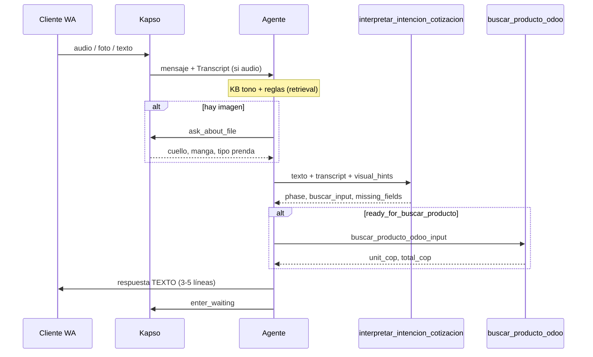

# Pipeline media — Functions + KB + Prompt (Life v10+)

Cómo integrar audio/foto **con functions dentro del agente** sin volver al grafo monolítico ni perder tono/KB.

---

## División de responsabilidades (no mezclar)

| Capa | Qué contiene | Qué NO contiene |
|------|--------------|-----------------|
| **Prompt slim** | Fases 1–3, tono, orden de tools, "siempre texto", cuándo handoff | Tablas de precios, reglas camiseta/uniforme, horarios |
| **KB** | Hechos, ejemplos cliente, flujo media narrativo, datos empresa | Código, scoring Odoo |
| **Kapso built-in** | `ask_about_file`, `get_whatsapp_context`, transcripción audio | Reglas Life |
| **Functions Life** | Lógica **determinística** (parse, match, precio Odoo) | Redacción comercial al cliente |

El agente **redacta** la respuesta (prompt + KB tono). Las **functions** devuelven JSON estructurado; el LLM no reinterpreta camiseta vs uniforme si ya llamó `interpretar_intencion_cotizacion`.

---

## Grafo: sin nodos nuevos

```
Start → guards → classify → agente vendedor → enter_waiting
```

Cada mensaje (texto | audio | foto | mix) **re-entra por Start**. Todo el pipeline media ocurre **dentro del agente** vía tools — igual que `buscar_producto_odoo` hoy.

**No reintroducir:** `media-intake-dispatcher`, nodo `transcribe-audio`, Decide post-agente.

---

## Cadena de tools (cliente vendedor)



### Rol de cada tool

| Tool | Tipo | Función |
|------|------|---------|
| `get_whatsapp_context` | Kapso | URL media, historial reciente |
| `ask_about_file` | Kapso | Visión: polo vs V, manga, prenda |
| **`interpretar_intencion_cotizacion`** | Life function | Transcript válido/basura; camiseta=sola; fase 1/2/3; arma input para buscar |
| `buscar_producto_odoo` | Life function | Match Odoo + precio live |
| `save_variable` | Kapso | `vars.intent`, `vars.media`, `quote.*` |
| `enter_waiting` | Kapso | Fin de turno |

**Audio:** Kapso transcribe → no hay function de STT. `interpretar_intencion_cotizacion` **valida y parsea** el `Transcript:`.

---

## Qué va en la function vs qué queda en KB

### En `interpretar_intencion_cotizacion` (código)

- Patrones transcript basura
- Regla **camiseta / camiseta de fútbol → camiseta_sola**
- **uniforme → uniforme_completo**
- Extracción cantidad (incl. "docena")
- Fase 1/2/3 según campos faltantes
- `ready_for_buscar_producto` + payload listo para `buscar_producto_odoo`
- Preview match (opcional, mismo motor que buscar)

### En KB (sin duplicar reglas en prompt)

| KB | Uso en media |
|----|----------------|
| `life_reglas_comerciales` | Horarios, dirección, 50%, mínimo 6 — cuando preguntan |
| `life_lenguaje_cliente_productos` | Ejemplos de cómo piden (retrieval semántico) |
| `life_flujo_audio_foto` | Narrativa del flujo para el agente |
| `kapso_whatsapp_patterns` | Transcript, ask_about_file, enter_waiting |
| `life_catalogo_precios` | "Desde" si fase 1 sin tool buscar |

### En prompt (solo orquestación)

```markdown
## Media
1. Transcript Kapso si audio (no ask_about_file en .ogg)
2. ask_about_file si imagen
3. interpretar_intencion_cotizacion con todo lo anterior
4. Si ready_for_buscar_producto → buscar_producto_odoo con el input devuelto
5. Redactar al cliente (KB tono); SIEMPRE texto; enter_waiting
```

El prompt **no** repite la tabla camiseta/uniforme — apunta a KB + function.

---

## Integración al desarrollo actual

### Ya hecho (repo)

- KB split + `embed_agent_knowledge.js`
- `buscar_producto_odoo` + `product_match_engine.js`
- `life_flujo_audio_foto_v1.md`
- Prompt v4 slim sección 5 (orquestación media)

### Paso siguiente (function nueva)

1. `functions/lib/quote_intent_parser.js` — parser
2. `node kapso/scripts/bundle_interpret_quote_intent.js`
3. Deploy Kapso: `interpret-quote-intent` → registrar `function_id` en `service_registry.json`
4. `orchestrator_agent_tools.yaml` → `tools_active`
5. `embed_agent_knowledge.js` → añadir tool al nodo vendedor (junto a buscar)
6. Prompt: sustituir detalle media por "llama interpretar_intencion_cotizacion"
7. Tests: `node kapso/tests/run_quote_intent_tests.js`

### Sin perder forma de responder

| Riesgo | Mitigación |
|--------|------------|
| Function devuelve JSON frío al cliente | Function **nunca** envía WA; solo el agente redacta |
| Prompt pierde personalidad | Tono/frases/cierre siguen en prompt + `life_reglas_comerciales` |
| KB deja de usarse | Prompt mantiene tabla "cuándo consultar KB"; functions no reemplazan precios/horarios |
| Doble fuente de verdad | Reglas camiseta/uniforme: **solo** parser + match engine; KB es documentación alineada |

---

## Staff

Misma function en agente staff: operaria reenvía audio/foto del cliente → `interpretar_intencion_cotizacion` → `buscar_producto_odoo` → borrador.

---

## Referencias

- `kapso/docs/kapso_voice_media_standard.md`
- `kapso/knowledge/life_flujo_audio_foto_v1.md`
- `kapso/functions/lib/quote_intent_parser.js`
- `kapso/docs/knowledge_layers.md`
