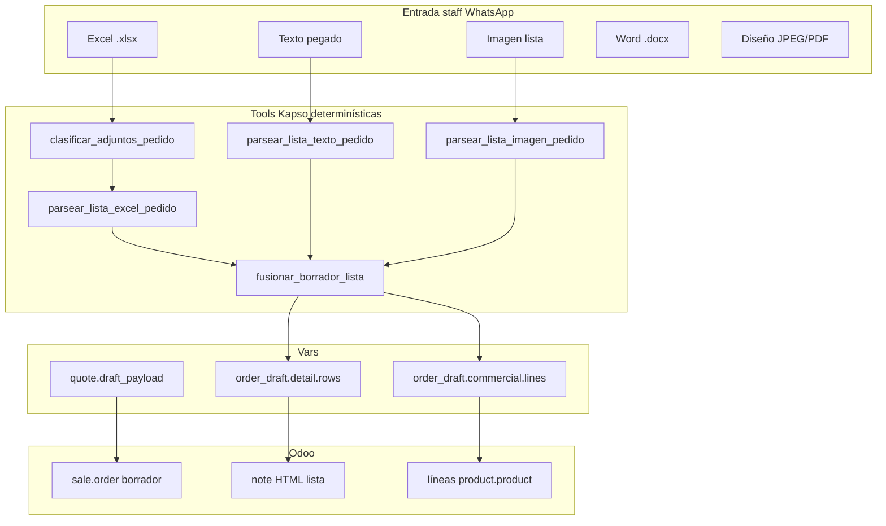
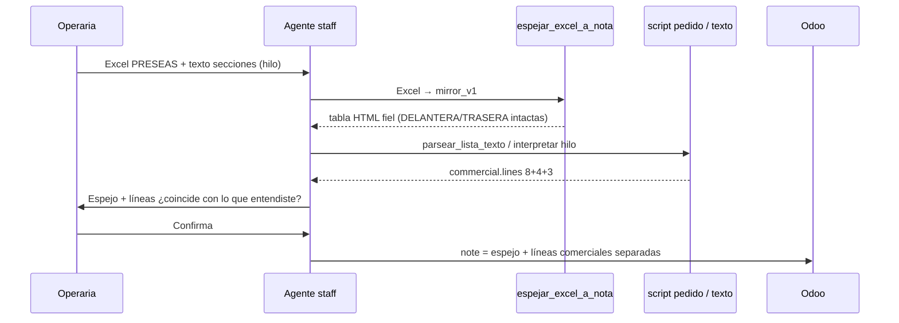
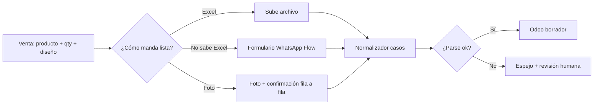

# Diagnóstico — flujo de detalle del pedido (Excel, hilo, imagen)

Documento de planificación **jul 2026**. Objetivo: sostener la diversidad de formatos en Colombia sin perder datos (PRESEAS, panamericano, Life estándar, texto, foto) y preparar un **WhatsApp workflow / formulario** en segunda fase.

**Nota nomenclatura:** **PRESEAS** (cliente recurrente, columnas DELANTERA/TRASERA, secciones chaquetas/camisetas/uniformes) **no lleva script dedicado**. Su Excel es un **ejemplo real de formato no reconocido** (Caso F): la tabla va **igual que la recibe** a la descripción/nota del SO en Odoo. En paralelo, el **script de pedido / agente** sigue interpretando lo entendible (secciones del hilo, cantidades, productos) para armar `commercial.lines`.

Referencias: `casos_lista_pedido_staff.md`, `order_detail_tools.md`, `scratch/preseas/`, `scratch/javier_panamericano/`.

---

## 1. Qué pasa hoy (resumen)



**Fortalezas:** parser Life (`formato_life_v1`), texto multi-sección (`list_section_products`), Word familia, tests automatizados.

**Debilidades observadas en producción:**

| Incidente | Qué falló | Lección |
|-----------|-----------|---------|
| **PRESEAS #14** (Paola, jul 2026) | Excel no estándar + texto multi-sección; parser Life forzó **15 filas como uniforme** (`parse_status: partial`); nota parcialmente bien, **líneas SO sin ×8 uniforme** | No forzar Excel PRESEAS a `formato_life_v1`; usar **espejo** en nota + **líneas comerciales** por otro canal (texto/agente) |
| **PRESEAS en vivo** | Script específico delantera/trasera no sostuvo la diversidad real del archivo | PRESEAS = **piloto del espejo fiel**, no caso con script propio |
| **Panamericano ajedrez** (Javier) | Excel con columnas Camiseta / Pantaloneta / Sudadera / Chaqueta — **no es Life** | Caso nuevo `panamericano_registro_v1`; reglas distintas por columna |
| **Copia FORMATO LIFE** (misma subida Javier) | Pestañas escolares sin `formato life` | `needs_sheet_choice` o `generic` |
| **Tatiana S02538** | Dos `.xls` viejos, dos equipos | Multi-adjunto + merge manual |
| **Genérico** | Cliente manda grid raro | Parser best-effort → operaria confirma o **espejo fiel** |

---

## 2. Casos reales — matriz ampliada

| Caso | Cliente / operaria | Entrada | Señales | Productos Odoo | Retos |
|------|-------------------|---------|---------|----------------|-------|
| **A** Life estándar | Mayoría clubes | Excel pestaña `formato life` | NOMBRE, TALLA, NUMERO, MAS/FEM, Camiseta/Uniforme | Uniforme fútbol 115 / camiseta 62 | Script Life; confundir `No.` con dorsal |
| **F + PRESEAS** (ejemplo real) | PRESEAS recurrente | Excel **sin** layout Life reconocido (cols DELANTERA/TRASERA, specs, grid propio) | Tabla cruda | — en nota | **Espejo fiel** → `sale.order.note`; no reinterpretar a Life |
| **I** PRESEAS texto | Mismo cliente | Texto hilo con `Chaquetas papás:` / `Uniformes:` | 3 bloques producto | Chaqueta 68 · camiseta 62 · uniforme 115 | **Script pedido**: `commercial.lines` (8+4+3); cotejar con espejo Excel |
| **P** Panamericano | Javier / ajedrez | Excel `Registro` | Color en col. Uniforme; Sudadera=pantalón; Chaqueta=parte superior | Uniforme / camiseta / sudadera completa / chaqueta sola | Medias inferidas; tallas cruzadas cam≠pan |
| **E** Multi-pestaña | Colegios | `.xlsx` sin formato life | Varias hojas listado | Según hoja | Operaria elige pestaña |
| **G** Día Familia | Eventos | Word tabla | UNIFORME NIÑOS / CAMISETA DAMA / CABALLERO | Por columna | Varias personas en una celda |
| **H/J** Texto / foto | Operaria apura | WhatsApp | Secciones o líneas sueltas | Inferir producto | Visión incompleta; dorsal/nombre ambiguo |
| **K** Solo diseño | Todos | JPEG | Sin filas | — | No parsear tallas |

---

## 3. Información necesaria por capa

### 3.1 Por fila de prenda (lista de detalle → `note` Odoo)

| Campo | Obligatorio | Variantes reales | Dónde va |
|-------|-------------|------------------|----------|
| **Nombre en uniforme** | Casi siempre | Apodo (`SANTI R.`), familiar (`Papá Ian`), **vacío a propósito** (PRESEAS #12), placeholder fem (`Camiseta #N`) | Columna Nombre HTML |
| **Talla** | Sí | Numérica infantil 8–16, S–XXL, **distinta por prenda** (cam S / pan M) | Columna Talla |
| **Dorsal / número** | Según producto | Repetido en equipo, **COACH sin dorsal**, `#65` en papás | Columna N° |
| **Producto / rol** | Implícito o explícito | Uniforme, camiseta, chaqueta, arquero, pantaloneta sola | Rol / variante |
| **Manga** | Uniforme/camiseta | Corta, larga, sisa, china (voley) | Rol o agrupación HTML |
| **Género** | Life estándar | MAS/FEM; bloque fem post-masc | Default producto |
| **Impresión delantera/trasera** | PRESEAS (parte del mismo caso) | ESCUDO, NOMBRE+#, SOLO # | Comentario / nota diseño |
| **Color / variante** | PRESEAS, panamericano | AZUL, GRIS, Azul Oscuro | Comentario |
| **Observaciones** | Opcional | «sin nombre en camiseta», «FAN #1 PAPA» | Comentario |

### 3.2 Por pedido (comercial → líneas SO)

| Campo | Fuente típica | Odoo |
|-------|---------------|------|
| Cliente / equipo | Hilo (`PRESEAS 14`) | `res.partner` por nombre |
| Proyecto diseño | Staff (Paola/Javier) | Nota «Proyecto Paola» |
| **Líneas cantidad × producto** | Secciones o conteo parser | `sale.order.line` |
| Variante Odoo | KB + `buscar_producto_odoo` | `product.product` (ej. chaqueta **con forro** 11740) |
| Diseño | Siempre ≥6 u. base | Línea 504 @ $0 |

### 3.3 Complemento paralelo (formulario / hilo venta)

Lo que **no** siempre está en el Excel pero el diseñador necesita:

- Disciplina / deporte (fútbol vs voley → template distinto)
- Cuello, manga, tela (dry-fit vs dumonti)
- Color general del diseño (adjuntos JPEG)
- ¿Nombre en camiseta sí/no? (PRESEAS filas solo dorsal)
- Abono / producción (fuera de lista; no en `note`)

---

## 4. Estrategia 1 (prioritaria) — Dos vías paralelas + borrador Odoo

### 4.0 Hard rule — subir sin confirmar

| Regla | Detalle |
|-------|---------|
| **Kapso nunca confirma** | `sale.order` solo en estado `draft`. Sin `action_confirm`. |
| **Operaria confirma en Odoo** | Más fácil corregir líneas/nota en Odoo que bloquear la subida en WhatsApp. |
| **Precisión máxima al subir** | Heurísticas + reglas (Life, secciones texto, espejo Excel, hilo, catálogo) — pero **imperfección no bloquea** el borrador. |
| **Warnings en nota** | Si `partial` / `mirror_v1`, incluir bloque «Revisar» en HTML para la operaria. |

El código actual (`odoo_create_lead_and_so.js`) ya crea borrador; la regla es de producto/prompts y **no** añadir confirmación automática.

### 4.1 Principio: script por layout reconocido; espejo para el resto

| Vía | Qué resuelve | Salida Odoo | Cuándo |
|-----|--------------|-------------|--------|
| **A — Detalle organizado** | Layout reconocido (Life A, panamericano P, familia G…) | `note` HTML estructurado + `detail.rows` | `layout === formato_life_v1` u otro caso con script en manifest |
| **B — Espejo fiel** | Excel **no reconocido** (PRESEAS = caso piloto) | `note` = tabla HTML **igual** al grid fuente (mismas columnas/filas/celdas) | `layout === generic` / `mirror_v1` |
| **C — Pedido comercial** | Lo que el agente/operaria **sí entiende** del hilo | `commercial.lines` → `sale.order.line` | Texto secciones, resumen operaria, parser parcial + confirmación |

**PRESEAS no va en `kapso/cases/` como script propio.** Va documentado como **fixture de prueba** del espejo (B) y como **ejemplo de cotejo** con la vía C (texto #14: 8+4+3).

```
kapso/cases/
  manifest.json
  life_formato_v1/           # layout reconocido Life
  panamericano_registro_v1/  # layout reconocido con reglas propias
  mirror_excel_v1/           # fallback: grid → HTML tabla Odoo (piloto PRESEAS)
  fixtures/
    preseas_excel_sample.xlsx  # prueba espejo, NO caso parseable
```

Tools:

- `detectar_caso_lista` → `{ layout, case_id?, use_mirror: bool }`
- `espejar_excel_a_nota` → `{ mirror_html, sheet_name, row_count, col_count }` (sin reinterpretar)
- `ejecutar_caso_lista` → solo layouts **reconocidos** en manifest

### 4.2 Flujo PRESEAS — espejo + pedido en paralelo



**No mezclar responsabilidades:**

- El **espejo** no inventa productos ni filas Life; solo copia.
- El **script de pedido** (agente + `fusionar_borrador_lista` + `odoo-create-lead-and-so`) suma uniformes, chaquetas, camisetas, diseño 504, partner PRESEAS, etc.
- Si solo hay Excel y líneas comerciales inciertas → **subir borrador** con espejo + mejor estimación heurística; operaria ajusta en Odoo.

**Validación `validar_cotejo_comercial` (nueva, no bloqueante):**

- Registrar warnings si `commercial.lines` no cuadra con secciones del hilo
- **No bloquear** subida por desajuste — el borrador en Odoo es el lugar de corrección
- Opcional: flag `order_draft.needs_odoo_review: true` en vars para el mensaje al staff

### 4.3 Espejo fiel — especificación (piloto PRESEAS)

Cuando el Excel **no** coincide con Life ni con otro caso del manifest:

**En `sale.order.note`:**

1. **Tabla espejo** — encabezados y celdas tal cual la hoja (incl. DELANTERA, TRASERA, LOGO PRESEAS, filas vacías)
2. **Metadatos** — archivo, pestaña, `layout: mirror_v1`
3. **Sin** conversión a columnas Life ni placeholders inventados

**Implementación:**

- `buildExcelMirrorHtml(grid)` en `build_odoo_order_note.js`
- Rama en `parsear_lista_excel_pedido`: si no Life → devolver `grid` + `mirror_html`, no `detail.rows` forzados
- Adjuntar `.xlsx` original al SO (complemento, no sustituto del espejo en nota)

**Prioridad del agente:**

1. Life reconocido + parse ok → HTML Life + `commercial.lines` heurísticas → **borrador Odoo**
2. Excel no reconocido (PRESEAS) → espejo en nota + líneas del hilo/heurística → **borrador Odoo**
3. Dudas → subir borrador con warnings; operaria corrige y **confirma en Odoo**

---

## 5. Estrategia 2 (segunda fase) — WhatsApp workflow / formulario

### 5.1 Visión del flujo de detalle

Hoy el **detalle** entra casi solo por **canal staff** (Paola/Javier). El workflow de venta al cliente cierra producto/cantidad; el detalle llega después, desordenado.

**Flujo objetivo (cliente u operaria):**



### 5.2 Cuándo formulario vs Excel vs foto

| Perfil cliente | Recomendación | Campos mínimos formulario |
|----------------|---------------|---------------------------|
| Colegio con coordinador | Excel Life (plantilla) | — |
| Club recurrente (PRESEAS) | Excel → espejo en nota; cantidades por texto/hilo o agente | Producto, nombre, talla, # (formulario futuro) |
| Padres poco digital | Flow por jugador o foto | Nombre, talla, dorsal, prenda |
| Pedido mixto (papás + niños) | **Secciones obligatorias** en form | Bloque prenda antes de filas |

**Preguntas que el formulario debe hacer (por jugador o por bloque):**

1. ¿Qué prenda? (uniforme / camiseta / chaqueta / sudadera / pantaloneta)
2. Nombre para imprimir (allow blank + flag «solo número»)
3. Talla
4. Número dorsal (allow blank — coach, papá)
5. Manga (si aplica)
6. Observaciones (arquero, color, «igual diseño papá»)

**Pantalla impresión (PRESEAS, mismo formulario):** delantera / trasera por fila uniforme — no es un flujo separado.

### 5.3 Relación formulario → Odoo

| Respuesta Flow | Mapeo |
|----------------|-------|
| `prenda=uniforme` | Línea acumulada uniforme 115; fila detalle |
| `prenda=chaqueta` | Chaqueta 68 (+ forro si checkbox papá) |
| `nombre_vacio=true` | `nombre_vacio_impresion` — no placeholder |
| `arquero=true` | Rol HTML arquero; mismo bucket uniforme/camiseta según reglas |

El normalizador del Flow debe emitir el **mismo JSON** que `fusionar_borrador_lista` espera (`detail.rows` + `commercial.lines`).

### 5.4 Retos Colombia (diversidad sana)

- **Misma extensión, distinto layout** — nunca asumir `.xlsx` = Life
- **Columnas con nombres engañosos** — panamericano: «Uniforme» = color; «Sudadera» = pantalón
- **Listas en el hilo + archivo distinto** — prioridad archivo reciente; cotejo si hay dos
- **Nombres familiares / apodos / sin nombre** — no forzar nombre completo en producción
- **Múltiples productos en un mensaje** — secciones obligatorias antes de parsear
- **Impresión ≠ producto** — DELANTERA/TRASERA va a diseño, no a línea SO extra

---

## 6. Checklist — precisión al subir borrador (operaria confirma en Odoo)

- [ ] **SO en `draft`** — Kapso no confirmó
- [x] Excel no Life → **`mirror_v1`** en nota cuando aplique (`buildExcelMirrorHtml`, jul 2026)
- [ ] **`commercial.lines`** con mejor heurística disponible (texto secciones, Life, catálogo)
- [ ] Warnings visibles en nota si hubo `partial` / desajuste conteos
- [ ] Partner por **nombre** del hilo (staff), no teléfono operaria
- [ ] Adjuntos: Excel + diseños en SO
- [ ] Mensaje final al staff: número SO + «revisa y confirma en Odoo»

---

## 7. Próximos pasos sugeridos (orden)

### Fase 1 — Kapso (semanas)

1. **`mirror_excel_v1`** + `buildExcelMirrorHtml` — piloto con fixture PRESEAS
2. **`parsear_lista_excel_pedido`**: si no Life → `use_mirror: true`, no filas Life forzadas
3. **`validar_cotejo_comercial`** — warnings en vars, **sin bloquear** subida (borrador = lugar de corrección)
4. **`cases/manifest.json`** solo para layouts **reconocidos** (Life, panamericano…); PRESEAS queda en `fixtures/`
5. Test E2E PRESEAS: Excel → espejo idéntico en `note` + texto hilo → `commercial.lines` 8/4/3 en SO

### Fase 2 — WhatsApp Flow (plan aparte)

1. Especificar `order_details_v2` con bloques prenda (schema JSON alineado a `list_section_products.js`)
2. Pantalla opcional impresión (PRESEAS)
3. Conectar rama `intent_next: flow_order_details` post-abono (ver `workflow_whatsapp_flows_wiring.md`)
4. Piloto con un colegio + PRESEAS en paralelo al canal staff

---

## 8. Archivos y scripts existentes

| Recurso | Uso |
|---------|-----|
| `docs/casos_lista_pedido_staff.md` | Catálogo humano A–L |
| `functions/lib/parse_life_excel.js` | Solo Life estándar reconocido |
| `functions/lib/list_section_products.js` | Texto multi-sección → commercial.lines |
| `mirror_excel_v1` (por implementar) | Excel no reconocido → nota Odoo; piloto PRESEAS |
| `scripts/convert_panamericano_registro_to_life.py` | Caso P (conversión) |
| `scratch/preseas/PRESEAS_14_resumen.md` | Post-mortem líneas SO |
| `tests/run_order_detail_tools_tests.js` | Regresión parsers |

---

Última actualización: **9 jul 2026** — hard rule: borrador Odoo sin confirmar; precisión heurística; operaria confirma en Odoo.
