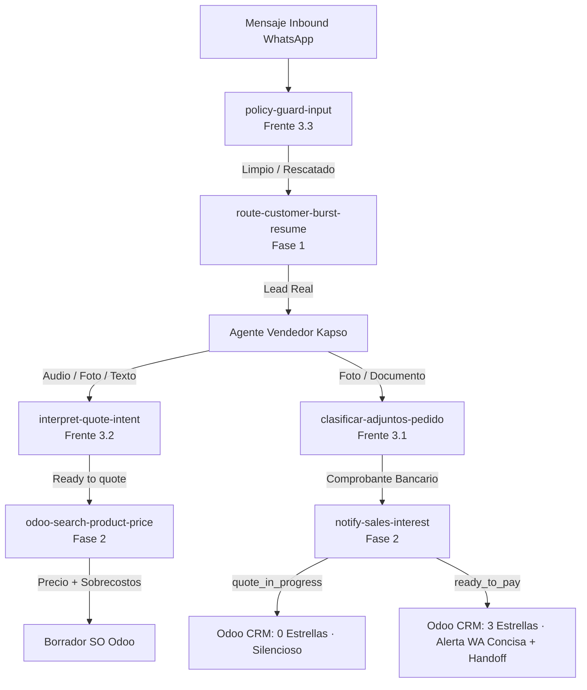

# Guía Técnica: Integración de Decisiones Jev en Kapso y Odoo

> **Audiencia:** Agentes de desarrollo (Antigravity, Cursor, Hermes, subagentes) e ingenieros.  
> **Modelo:** `typesafe/jev-1.13` vía OpenRouter Decisions API (`POST https://openrouter.ai/api/alpha/decisions`).  
> **Estado:** 6 funciones en producción activa (`LIFE_JEV_MODE="on"`).

---

## 1. Principio Fundamental: Decisiones Probabilísticas vs Lógica Determinista

En la arquitectura de Life Deportes:
- **Jev toma decisiones:** Clasifica intenciones, roles de adjuntos, cuellos sport, tallas especiales (2XL/3XL) y riesgo de jailbreak con distribución de probabilidad y nivel de confianza.
- **El código local ejecuta:** Calcula precios matemáticos exactos, llama a XML-RPC de Odoo, adjunta registros o envía alertas.
- **PROHIBIDO delegar el cálculo de precios o la confirmación de pedidos a un LLM generativo libre.**

---

## 2. Mapa de Integración en el Grafo Kapso (`lifedeportes_sales_inbound`)



---

## 3. Las 6 Funciones en Producción y sus IDs

| Función | ID en Kapso | Script / Bundle | Switch Env | Fallback Determinista |
|---|---|---|---|---|
| `route-customer-burst-resume` | `972d60bb-ff84-40fc-ba3d-cdd6104aa143` | `route_customer_burst_resume.js` | `LIFE_JEV_MODE` | Debounce 15s + heurística de texto |
| `odoo-search-product-price` | `4503ca5c-7114-4442-bada-112be3ddf67e` | `odoo_search_product_price.js` | `LIFE_JEV_MODE` | Regex de tallas y catálogo base |
| `notify-sales-interest` | `a2236fdc-8afa-40ab-a09f-d231c2b638cd` | `notify_sales_interest_deploy.js` | `LIFE_JEV_MODE` | `ready_to_pay` seguro |
| `clasificar-adjuntos-pedido` | `8d383baa-305a-4ada-9ec4-f8db69736ebb` | `classify_order_attachments_deploy.js` | `LIFE_JEV_MODE` | `inferAttachmentRole(filename, mime)` |
| `interpret-quote-intent` | `e9ee8299-bcf7-4a3d-9dd9-5dd23118a015` | `interpret_quote_intent.js` | `LIFE_JEV_MODE` | `parseQuoteIntent` determinista |
| `policy-guard-input` | `3800675c-b32c-46c4-b896-2a885f58421c` | `policy_guard_input.js` | `LIFE_JEV_MODE` | Regex anti-inyección estándar |

---

## 4. Cómo Integrar Jev en un Nuevo Paso o Tool

Cualquier agente que necesite añadir una decisión a una Cloudflare Worker de Kapso debe seguir esta plantilla:

```javascript
async function decideWithJev(env, state, questions) {
  const mode = String(env?.LIFE_JEV_MODE || "off").toLowerCase().trim();
  const key = env?.OPENROUTER_API_KEY;

  if (mode === "off" || !key) return null;

  const t0 = Date.now();
  const ctrl = new AbortController();
  const timer = setTimeout(() => ctrl.abort(), 6000);

  try {
    const res = await fetch("https://openrouter.ai/api/alpha/decisions", {
      method: "POST",
      headers: {
        "Authorization": `Bearer ${key}`,
        "Content-Type": "application/json",
      },
      body: JSON.stringify({
        model: "typesafe/jev-1.13",
        state,
        questions,
      }),
      signal: ctrl.signal,
    });
    clearTimeout(timer);

    if (!res.ok) return null;
    const data = await res.json();
    return {
      ok: true,
      mode,
      answers: data?.answers || {},
      latencyMs: Date.now() - t0,
    };
  } catch {
    clearTimeout(timer);
    return null; // Fail-open: continúa con lógica determinista
  }
}
```

---

## 5. Control Operativo

Para alternar modos en todas las funciones o en una sola:
```bash
# Cambiar todas
node kapso/scripts/set_jev_mode.js --all --mode on
node kapso/scripts/set_jev_mode.js --all --mode shadow
node kapso/scripts/set_jev_mode.js --all --mode off

# Cambiar una sola
node kapso/scripts/set_jev_mode.js --function classify_media --mode on
```
