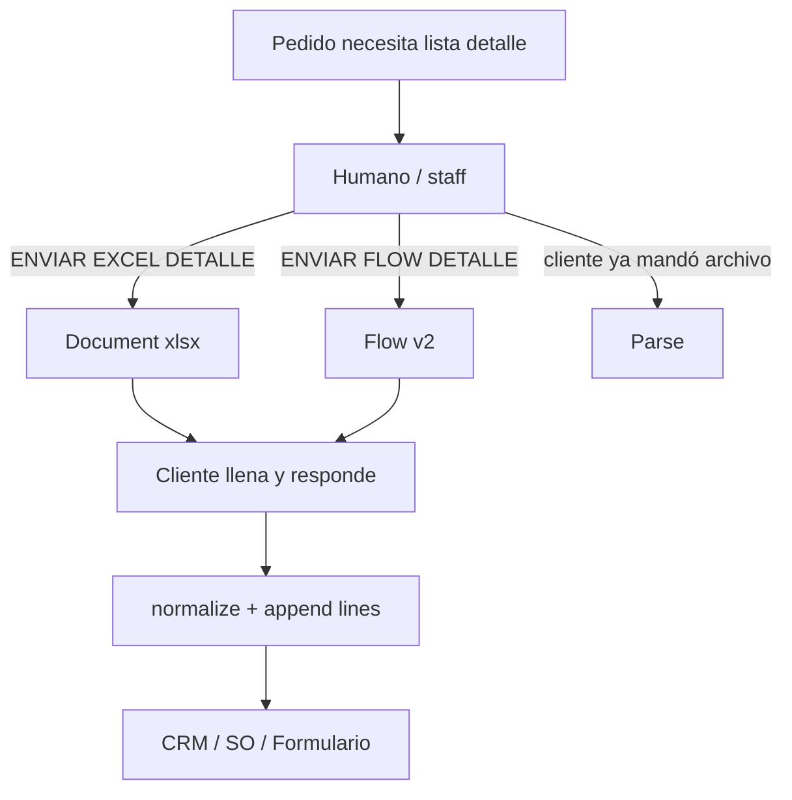
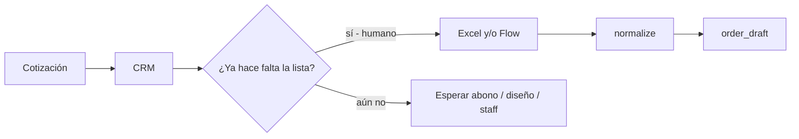

# Plan: detalle de pedido — Excel **o** WhatsApp Flow

Fecha: 2026-07-27 · actualizado con decisiones Diego  
Fuente Excel: `raw/projects/Formulario-pedido-lifedeportes(1).xlsx` (pestaña `Formato-detalle-Pedido`)  
Relacionado: `whatsapp_flows_lote1_spec.md`, `workflow_whatsapp_flows_wiring.md`, `docs/diagnostico_flujo_detalle_pedido.md`

---

## 1. Objetivo

Dos caminos **equivalentes**; el cliente elige por facilidad:

| Canal | Para quién | Resultado |
|-------|------------|-----------|
| **Excel nuevo** (`Formato-detalle-Pedido`) | Clientes nuevos / quien prefiere hoja | Mismo `vars.order_details` |
| **WhatsApp Flow** | Quien prefiere celular | Mismo `vars.order_details` |
| Formato Life clásico | Pedidos/colegios que ya lo usan | Sigue soportado (parser viejo) |

**No** se fuerza un canal. Primero **prueba interna** (staff / números de prueba); luego clientes.

---

## 2. Decisiones cerradas (2026-07-27)

| Tema | Decisión |
|------|----------|
| Filas en Flow | **6 por tanda**, **ampliable**: más tandas del mismo Flow (humano reenvía o el cliente vuelve a abrir). Pedidos grandes (20–60) = varias tandas **o** Excel. |
| Producto | **No obligatorio por fila.** Se define **por grupo** (todas las camisetas, luego todas las chaquetas, etc.). |
| Excel a nuevos | Enviar el Excel **nuevo** (no Life clásico por defecto). Archivo hospedado para envío fácil desde Kapso (media/asset, no “KB de texto”). |
| Quién dispara el Flow | **Humano** (inbox / handoff / staff) cuando el pedido **necesita** la lista de detalle — timing variable. Debe ser **fácil de acceder** (comando corto). |
| Piloto | Interno primero; sin broadcast a clientes hasta ok. |

---

## 3. Excel nuevo (referencia)

Pestaña: **`Formato-detalle-Pedido`**.

**Cabecera:** Nombre equipo · Color medias · Deporte.  
**Filas:** Producto · No. · Nombre · Talla · Cantidad · Manga · Género · Comentario · Arquero.

Layout parser: `formato_detalle_pedido_v1`. Formato Life clásico (`formato_life_v1`) permanece.

### Cómo enviar el Excel desde Kapso

No es knowledge base (eso es texto para el agente). Opciones:

1. **Preferida:** media WhatsApp ya subida — `whatsapp_media_id` en `service_registry.json` → `assets.formulario_detalle_pedido_xlsx`. **Expira ~30d**; la function `enviar-formulario-excel` re-sube desde B64 si falla.  
2. Staff: comando **`ENVIAR EXCEL DETALLE`** → tool `enviar_formulario_excel` (document al WA del cliente). Doc: `docs/enviar_formulario_excel.md`.  
3. Cliente (vendedor): pregunta lista/tallas → misma tool al chat actual.  
4. Alternativa: link Drive/Odoo público (menos control).

Research Flows (go/no-go): `docs/research_whatsapp_flows_detalle_pedido_2026-07-27.md`.

El archivo fuente vive en Sync: `raw/projects/Formulario-pedido-lifedeportes(1).xlsx` (inmutable). Copia operativa en `kapso/assets/Formulario-detalle-pedido.xlsx` para upload.

---

## 4. Flow `order_details_v2` — UX

### Modelo: grupos de producto + tandas de 6

```
Pantalla GRUPO
  → Producto del grupo (Camiseta | Uniforme | Chaqueta | …)  [una vez]
  → Deporte / equipo / medias (si aún no están)
  → “Va a cargar hasta 6 personas de este producto”

Pantallas FILA 1…6  (o menos si elige 1–6)
  → Nombre, Talla, No. (opc), Cantidad, Manga, Género, Arquero, Comentario
  → Sin campo Producto por fila (hereda el grupo)

Pantalla CIERRE
  → “Enviamos N de {producto}. ¿Faltan más de este u otro producto?
     Pida otra tanda al asesor o use el Excel.”
```

**Ampliar cantidad:**

- Mismo Flow otra vez (humano: `ENVIAR FLOW DETALLE` de nuevo) → Kapso **append** a `order_details.lines[]` (no reemplaza).  
- Cambio de producto: nueva tanda con otro grupo (camisetas → chaquetas).  
- Si N ≫ 12–15: sugerir Excel.

### Payload canónico

```json
{
  "flow": "order_details_v2",
  "batch_id": "uuid",
  "team_name": "…",
  "disciplina": "Futbol",
  "color_media": "blanco",
  "product_group": "Camiseta",
  "lines": [
    {
      "producto": "Camiseta",
      "nombre_uniforme": "Paisa",
      "talla": "S",
      "numero": "12",
      "cantidad": 1,
      "manga": "Corta",
      "genero": "Masculino",
      "arquero": false,
      "comentario": null
    }
  ]
}
```

`producto` en cada línea se **rellena** desde `product_group` al normalizar.

---

## 5. Quién envía qué (humano-fácil)

El detalle **no** es automático al stage: depende del pedido. El humano decide.

| Comando (staff / inbox) | Acción |
|-------------------------|--------|
| `ENVIAR EXCEL DETALLE` | Document `.xlsx` al WhatsApp del **cliente** |
| `ENVIAR FLOW DETALLE` | Interactive Flow `order_details_v2` al cliente |
| `ENVIAR DETALLE` | Pregunta corta al humano: Excel o Flow; o envía ambos en un mensaje (“elija el que le quede fácil”) |

Acceso:

- **Carril staff** WA (comandos arriba) — ya es el control room.  
- **Inbox Kapso** en handoff: mismos atajos o botones rápidos cuando existan.  
- No requiere que el vendedor bot lo dispare solo.

Tras recibir Excel/Flow/texto → misma ruta `normalize-order-details` → `order_draft` / Formulario.



---

## 6. Funnel (orientativo)



Si llega lista antes de tiempo → `order_details.partial` (no bloquea).

---

## 7. Fases (piloto interno primero)

| Fase | Qué | Gate |
|------|-----|------|
| **A** | Copiar Excel a `kapso/assets/`, subir media Kapso, comando `ENVIAR EXCEL DETALLE` (staff → cliente de prueba) | Ok interno |
| **B** | Parser `formato_detalle_pedido_v1` + tests con el xlsx de raw | Ok interno |
| **C** | Flow draft `order_details_v2` (grupo + 6 filas) + preview Meta | Ok interno |
| **D** | `ENVIAR FLOW DETALLE` + append de tandas en normalize | Prueba staff↔staff / número piloto |
| **E** | Prompt/cheatsheet comandos; **luego** clientes reales | Ok Diego |

---

## 8. Fuera de alcance (ahora)

- Flow dinámico con data API (filas infinitas en una sola sesión).  
- Deprecar Formato Life en producción.  
- Envío automático del Flow al pasar a Presupuesto (el webhook de estado **no** manda Flow; el humano sí).
