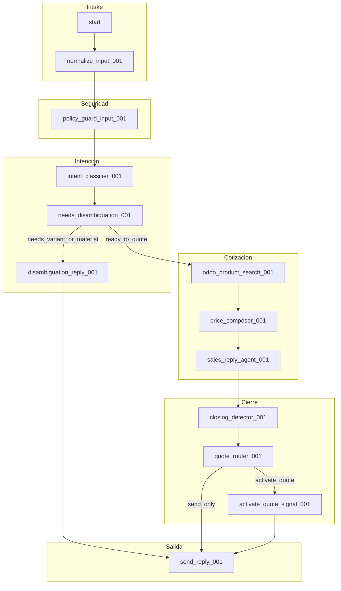

# Workflow `lifedeportes_sales_inbound_v1` — Documentación del grafo

Fuente: [`workflow_lifedeportes_sales_inbound_v1.json`](../workflow_lifedeportes_sales_inbound_v1.json).

## Resumen

Pipeline **inbound WhatsApp → normalización → firewall de entrada → clasificación de intención → (desambiguación o cotización Odoo) → respuesta comercial → detección de cierre → envío de mensaje**.  
La cotización formal por señal (`emit-quote-signal`) se activa solo cuando `vars.quote.should_activate == true`.

## Tabla de nodos

| id | Nombre descriptivo | Tipo Kapso | Fase | Entrada principal | Salida / efecto |
|----|-------------------|------------|------|-------------------|-----------------|
| `start` | Disparador inbound WhatsApp | `trigger_whatsapp_inbound` | Intake | Evento `inbound_message` | Inicia ejecución |
| `normalize_input_001` | Normalizar texto y teléfono | `function` (`normalize-input`) | Intake | `context.message.text`, `context.message.from` | Texto/teléfono listos en contexto |
| `policy_guard_input_001` | Firewall / sanitización de entrada | `function` (`policy-guard-input`) | Seguridad | Mensaje normalizado | Entrada filtrada; puede setear flags en `vars` |
| `intent_classifier_001` | Clasificar intención (agente) | `agent` | Intención | Prompt `prompts/sales_agent_v2.md` | `vars.intent` (producto, cantidad, flags) |
| `needs_disambiguation_001` | Decidir si falta desambiguación | `decide` | Intención | `vars.intent.requires_disambiguation` | Rama A o B |
| `disambiguation_reply_001` | Plantilla pregunta de desambiguación | `template` | Intención | `vars.intent.disambiguation_question` | Texto de respuesta |
| `odoo_product_search_001` | Buscar producto/precio en Odoo | `function` (`odoo-search-product-price`) | Cotización | `vars.intent.*` | Resultados precio/producto |
| `price_composer_001` | Componer precio en COP | `function` (`compose-price-cop`) | Cotización | Salida búsqueda | `vars` para respuesta |
| `sales_reply_agent_001` | Redactar respuesta comercial | `agent` | Cotización | Prompt + tool Odoo | `vars.reply_text` (implícito vía composer) |
| `closing_detector_001` | Detectar intención de cierre / activar cotización | `function` (`detect-quote-activation`) | Cierre | Historial / reply | `vars.quote.should_activate` |
| `quote_router_001` | Enrutar activación de cotización | `decide` | Cierre | `vars.quote.should_activate` | `activate_quote` vs `send_only` |
| `activate_quote_signal_001` | Emitir señal para workflow de cotización | `function` (`emit-quote-signal`) | Cierre | — | Dispara workflow downstream / evento interno |
| `send_reply_001` | Enviar mensaje WhatsApp | `whatsapp_send_message` | Salida | `vars.reply_text` | Mensaje al cliente |
| `error_fallback_001` | Mensaje de error genérico | `template` | Salida (error) | Texto fijo | **No conectado en `edges`** — ver nota |

## Leyenda de aristas (`decide`)

| Nodo | Etiqueta | Significado de negocio |
|------|----------|------------------------|
| `needs_disambiguation_001` | `needs_variant_or_material` | Falta aclarar variante/material antes de buscar en Odoo; solo se envía la pregunta y sale por `send_reply_001`. |
| `needs_disambiguation_001` | `ready_to_quote` | Datos suficientes para `search_read` de producto y armar precio. |
| `quote_router_001` | `activate_quote` | Cliente mostró cierre; se emite señal y luego se envía respuesta. |
| `quote_router_001` | `send_only` | Solo respuesta conversacional, sin activar cotización formal. |

## Nodo huérfano

- **`error_fallback_001`**: definido en `nodes` pero **no aparece en `edges`**. Opciones: conectarlo desde `policy_guard_input_001` o `intent_classifier_001` en caso de fallo, o eliminarlo del grafo si no se usa.

## Diagrama Mermaid (1:1 con IDs del JSON)

## Convención de nombres para futuras versiones

Para nuevos nodos (p. ej. `v2`), usar IDs estables tipo `{fase}_{accion}_{timestamp}` según el contrato de grafos Kapso. No renombrar IDs existentes sin migración explícita (`lock_version`).

## Referencias

- [kapso_workflow_spec.md](../kapso_workflow_spec.md)
- [DEPLOY_STEPS.md](../DEPLOY_STEPS.md)
