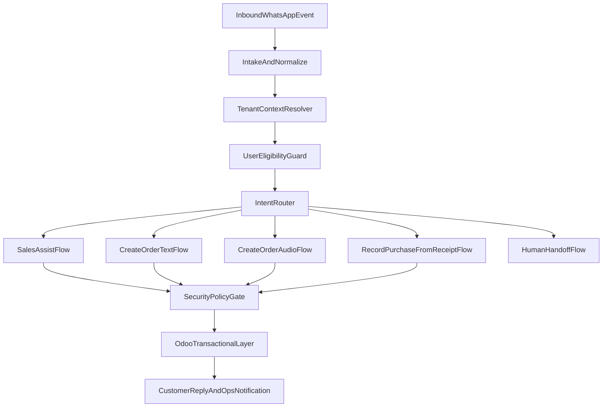

# Target Architecture v2 - Life Deportes Sales Agent

## Architecture principles
- Single agent surface for customers; specialized workflows behind intent routing.
- Playbook-first business logic, with Odoo as pricing and quote source of truth.
- Tenant isolation by context, secrets, and policy.
- Mandatory security gate before any MCP/Odoo operation.

## Canonical intents
- `sales_assist`: advisory and commercial qualification.
- `create_order_text`: capture order from text conversation.
- `create_order_audio`: capture order from audio transcription.
- `record_purchase_from_receipt`: register purchase from receipt image.
- `handoff_human`: escalation to human operator.

## Canonical state machine
- `intake`: identify sender, tenant, and interaction mode.
- `qualification`: classify intent and check eligibility.
- `capture`: collect required fields for selected intent.
- `validation`: enforce playbook and data completeness.
- `execution`: invoke transactional workflow/Odoo actions.
- `closure`: reply with next steps, SLA, and trace reference.
- `handoff`: escalate with context packet when risk/ambiguity threshold is exceeded.

## Canonical context contract (`vars`)
```json
{
  "tenant": {
    "id": "life_main",
    "channel_phone_number_id": "1081649091701994",
    "policy_set": "sales_default_v1"
  },
  "user": {
    "wa_id": "573xxxxxxxxx",
    "role": "customer",
    "is_allowed_for_transactions": true
  },
  "intent": {
    "type": "sales_assist",
    "confidence": 0.93,
    "requires_handoff": false
  },
  "quote": {
    "product_text": "uniforme futsal",
    "material": "dry fit",
    "variant": "manga corta",
    "quantity": 10
  },
  "security": {
    "policy_version": "2026-04-21",
    "mcp_call_count": 0
  }
}
```

## Data flow


## Required output contract
Every workflow returns:
```json
{
  "status": "ok",
  "intent": "create_order_text",
  "trace_id": "wf_...",
  "customer_message": "Texto a enviar",
  "ops_event": {
    "type": "order_created",
    "tenant_id": "life_main"
  }
}
```
