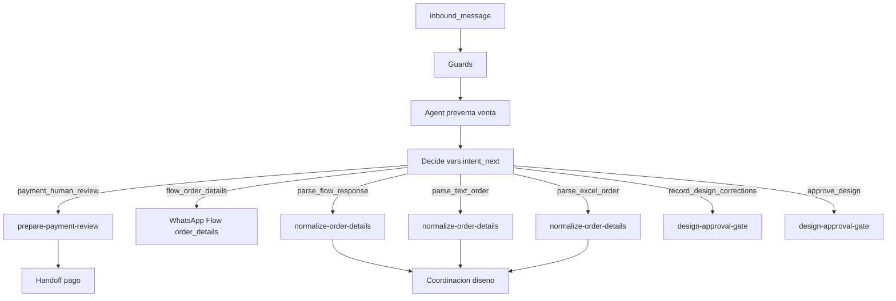

# Cableado: WhatsApp Flows ↔ workflows Kapso ↔ Odoo

## Eventos

Cuando un cliente completa un **WhatsApp Flow**, Kapso puede enrutar la respuesta al workflow con `source: whatsapp_flow` y payload en `flow_events` / contexto de ejecución (ver skill `automate-whatsapp`, `references/functions-payloads.md`).

## Patrón v4 recomendado

Preventa y venta se mantienen en conversación con el Agent. Los Flows no se usan como requisito para cotizar ni para confirmar pago, porque el `sales_playbook` real muestra una venta flexible y el comprobante siempre requiere verificación humana.

Los Flows quedan para posventa estructurada, después de que un humano aprueba el abono. Si Meta mantiene los Flows en `draft`, el fallback oficial es texto guiado por WhatsApp y normalización con `normalize-order-details`.

## Mapeo de payloads

| Entrada | Campos principales | Destino sugerido |
|--------------|----------------------|------------------------|
| Conversación preventa | producto, cantidad, variante, material, notas parciales | `vars.quote.*`, luego Odoo con precio exacto |
| Comprobante por chat | imagen/PDF/texto, referencia, monto esperado | `vars.payment.review_packet`; handoff humano |
| `order_details_v1` | `disciplina`, `color_media`, `lines_detail`, `design_references` | `vars.order_details.*` con esquema `life_designer_order_v1` |
| Excel cliente | filas tipo nombre, talla, número, deporte, pago | Normalizador determinístico antes de Odoo/diseño |
| Texto libre | lista de jugadores y observaciones | `normalize-order-details`, pedir solo faltantes |
| Diseño aprobado/correcciones | texto exacto del cliente | `vars.design.*`; producción solo si `approved` |

## IDs de referencia

Ver [whatsapp_flows/kapso_flow_registry.json](whatsapp_flows/kapso_flow_registry.json).

## Estado actual en `lifedeportes_sales_inbound`

El workflow v4 mantiene un solo Flow de cara al cliente:

| Rama `vars.intent_next` | Nodo | Proposito |
|---|---|---|
| `flow_order_details` | `send_flow_order_details_1745500005000` | Pedir detalles de diseno despues de pago aprobado |
| `payment_human_review` | `prepare-payment-review` + handoff | Armar paquete para verificacion humana |
| `parse_flow_response` | `normalize-order-details` | Parsear `nfm_reply` de Flow |
| `parse_excel_order` | `normalize-order-details` | Normalizar filas extraidas de Excel |
| `parse_text_order` | `normalize-order-details` | Normalizar texto libre |
| `record_design_corrections` | `design-approval-gate` + handoff | Pasar correcciones a diseno |
| `approve_design` | `design-approval-gate` | Habilitar produccion |

`quote_intake_v1` y `payment_ack_v1` quedan como assets historicos/deprecados. No son prioridad de deploy.

## Consumo de respuesta del Flow

Cuando el cliente completa un Flow, WhatsApp envía un `nfm_reply` como mensaje entrante → re-dispara el workflow. Pasos para procesar el payload estructurado:

1. El Agent detecta que el mensaje entrante trae `context.message.interactive.nfm_reply.response_json`.
2. Llama `complete_task` con `vars.intent_next = "parse_flow_response"`.
3. `normalize-order-details` persiste `vars.flow.*`, `vars.order_details.*` y `vars.production_order.ready_for_design`.

Hasta que los Flows estén **publicados** en Meta, `send_interactive(flow)` puede fallar. En ese caso el agente debe pedir los detalles por texto y enrutar a `parse_text_order`.
